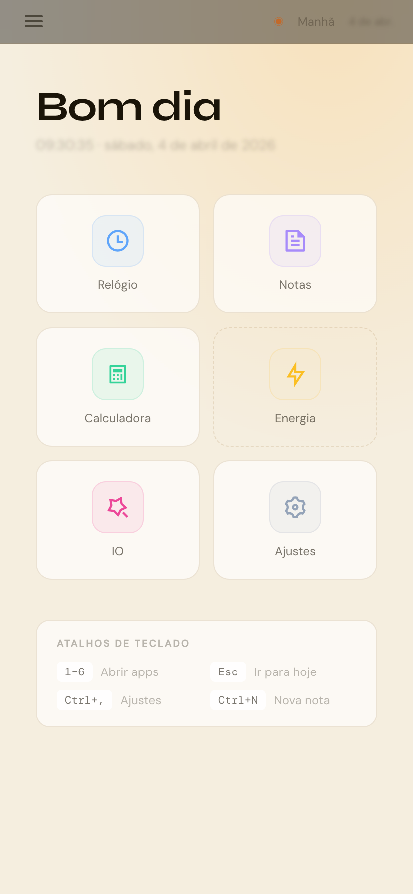
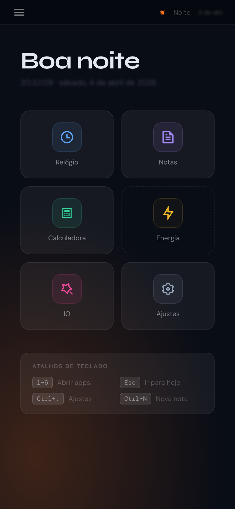

# Ioverso

Uma suíte de produtividade baseada em React com interface inspirada em sistema operacional. O Ioverso oferece uma experiência de usuário fluida com temas dinâmicos que se adaptam ao período do dia.

## Preview

| Manhã | Noite |
|-------------|---------------|
|  |  |

## Tecnologias Utilizadas

- **React** - Biblioteca JavaScript para construção de interfaces
- **Vite** - Build tool rápido para desenvolvimento
- **Framer Motion** - Biblioteca de animações
- **react-i18next** - Internacionalização
- **Dexie.js** - Wrapper para IndexedDB
- **Three.js** - Biblioteca 3D para WebGL
- **@remixicon/react** - Ícones Remix
- **CSS Custom Properties** - Sistema de temas dinâmicos

## Licença

Este é um projeto open-source e está disponível sob a licença MIT.
